# JavaScript-Trivia-Challenge

## Project

This project entailed building a timed coding quiz with multiple choice questions. The web application if susccessfully completed, should run in the browser, and will feature dynamically updated HTML and CSS powered by Javascript code that I will write.

## User Story

AS a coding bootcamp student
I WANT to take a timed quiz on Javascript fundamentals that stores high scores
SO THAT I can gauge my progress compared to my peers.

## Acceptance Criteria

In order to successfully achieve what has been set outi n the 'Acceptance Criteria', I need ot ensure that:

1. A 'start button' when clicked, starts a countdown on the timer and the first question qppears.
2. Questions contain a button for each answer.
3. When answer is clicked, the next question appears.
4. If the answer clicked was incorrect then subtract time from the clock.
5. The quiz should end when all questions are answered or the timer reaches 0.
6. When the game ends, it should display their score and give the user the ability to save their initials and their score.

## Outcome

This project was challenging in the sense that I had never worked with 2 Javascript files before. Additionally it was challenging adding an 'Array' to local storage, retrieving that on the second Javascript file and getting the initials and score to display the way I wanted them to. Nevertheless I was able to achieve everything set out in the 'Acceptance Criteria', and they are:

1. Clicking the start button initializes everything. The timer starts counting down from '100' and the first question appears.
2. The questions all contain a button for each answer.
3. When the answer is clicked, the next question appears: whether the answer is wrong or right.
4. If the answer clicked was incorrect then '10' seconds are subtracted. Additionally whether the answer is correct or incorrect, a corresponding text underneath the quiz appears, saying whether 'Correct!!' or 'Wrong!!'.
5. The quiz ends when all questions are answered or when the timer reaches 0.
6. When the game ends, and the user enters their initials in the input box provided, they are redirected to the 'Highscores' page where they can see their initials and their score. Additionally their information is saved to the local storage, so they can see previous highscores, unless they clock on 'Clear Highscores' which clears the page and clears the local storage as well.

## Screenshots

Here are some screesnhots of code involved with the project and it's deployed state on the browser.

1. 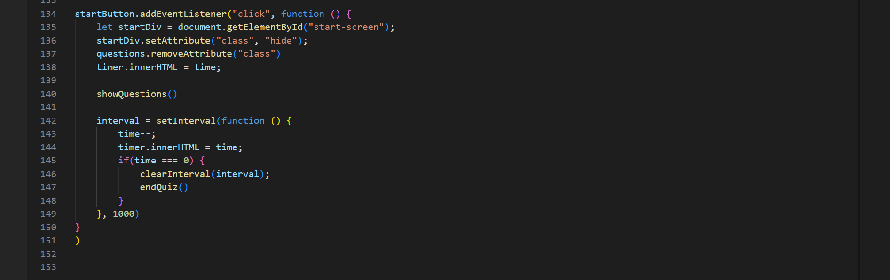
Code for the how the start button works once it is clicked, and how the timer works with it.

2. 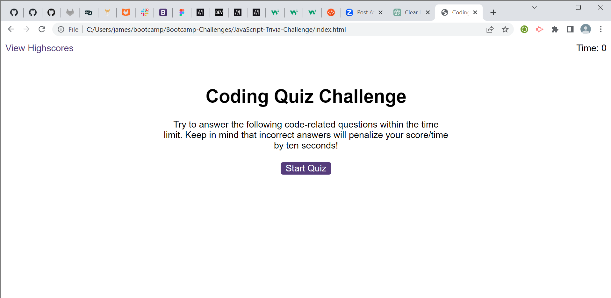
The starting page of the quiz, before the start button is clicked.

3. 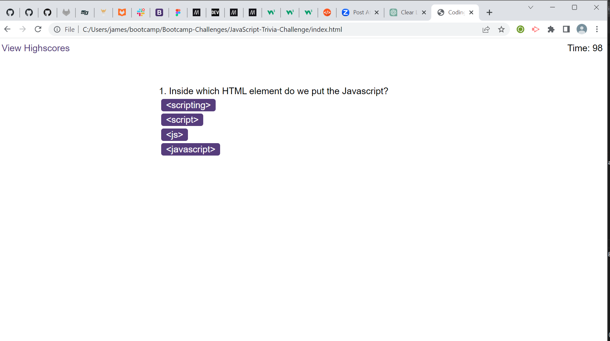
This shows us what the browser shows as soon as the 'Start Quiz' button is clicked.

4. 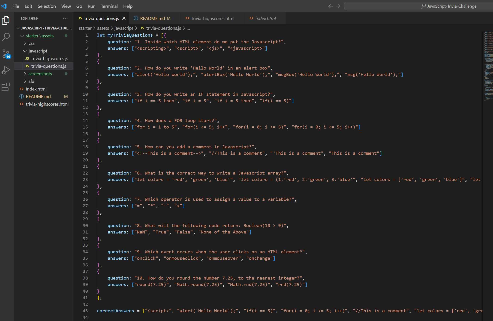
An array of the questions and answers.

5. 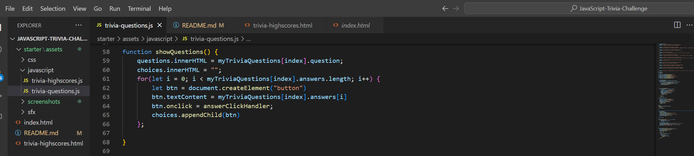
A function which shows how the questions and answer will be displayed on the DOM.

6. 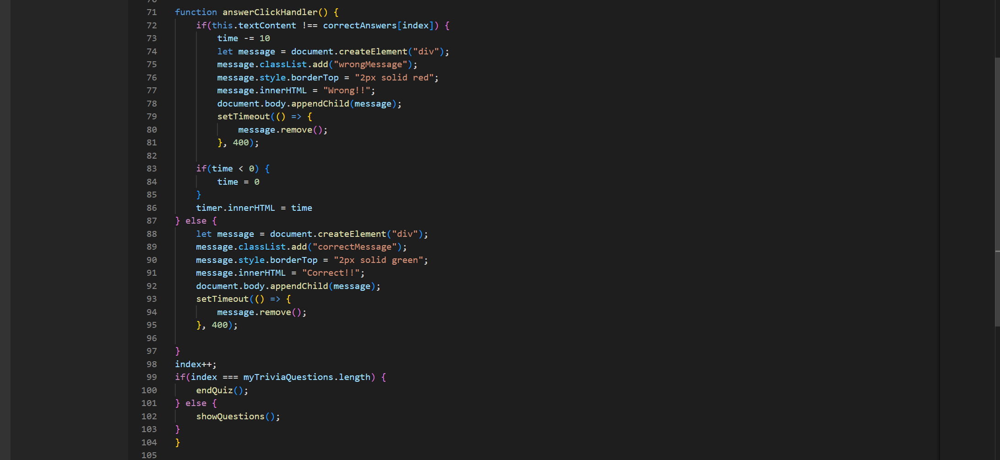
An event listener and function which shows how the web application behaves if a wrong or right answer is clicked.

7. 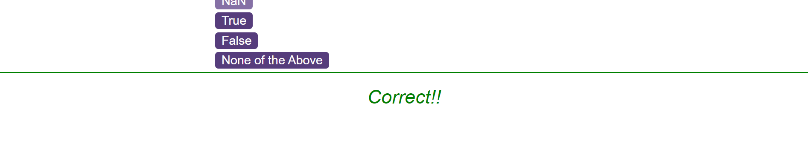

 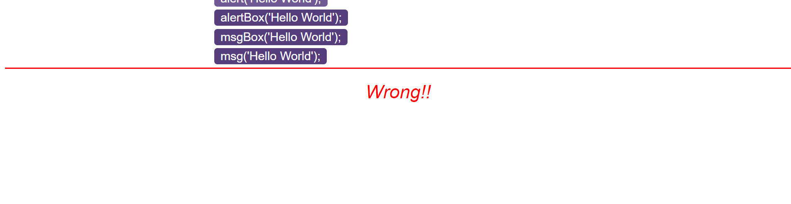
What appears on the browser if a wrong or right answer is clicked.

8. 
A function that shows us what happens when the quiz ends and when the quiz should end.

9. 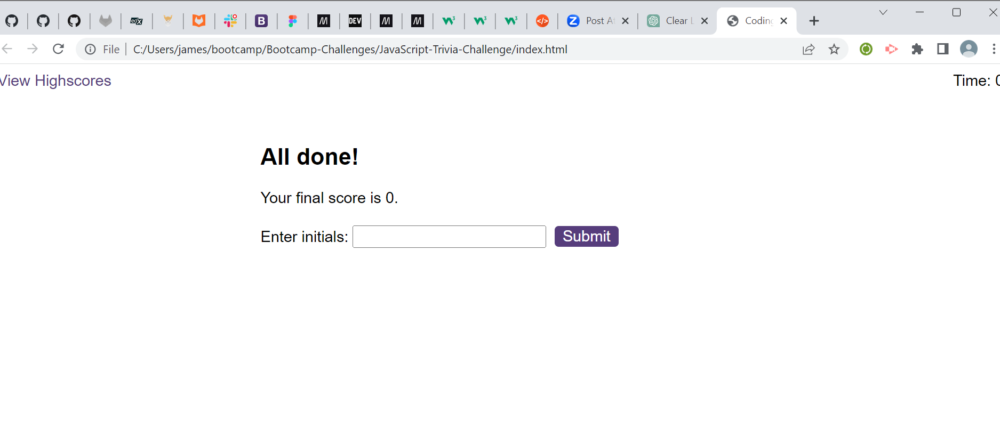
This should us in the browser what it looks like when we come to the end of the quiz, there's space to input your initials and when you submit it, takes you to the highscores page.

10. 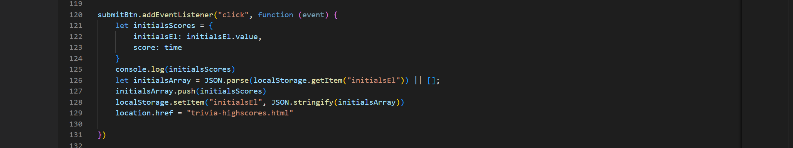
The code here shows us what happens when the submit button is clicked for example taking us to a new page and also very importantly saving information onto the local storage to be retrieved on the highscores page.

11. 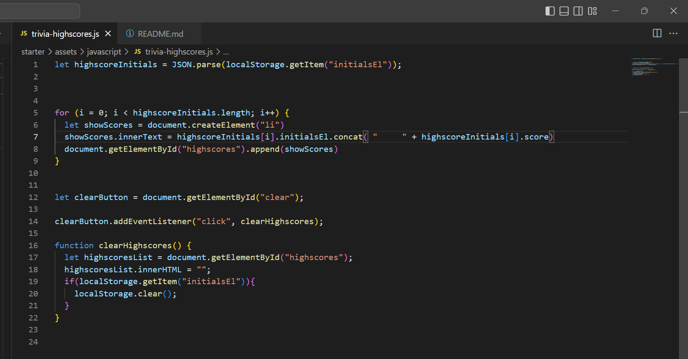
This page shows us how the information is retireved from local storage and then displayed on the highscores page. Addtionally it shows how when the 'Clear Highscores' button is clicked everything from the page is removed and the local storage also cleared.

12. 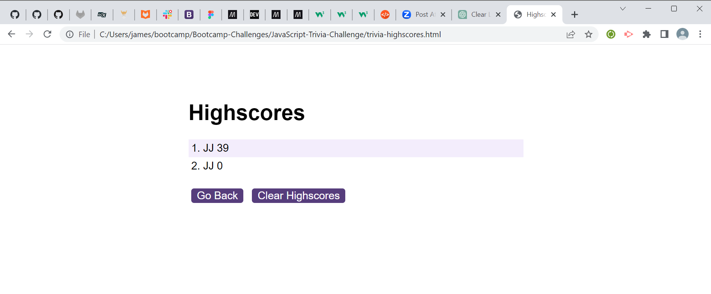
This shows us what the highscores page looks like with some information on it.

## License

MIT License

Copyright (c) 2022 JayClay922

Permission is hereby granted, free of charge, to any person obtaining a copy of this software and associated documentation files (the "Software"), to deal in the Software without restriction, including without limitation the rights to use, copy, modify, merge, publish, distribute, sublicense, and/or sell copies of the Software, and to permit persons to whom the Software is furnished to do so, subject to the following conditions:

The above copyright notice and this permission notice shall be included in all copies or substantial portions of the Software.

THE SOFTWARE IS PROVIDED "AS IS", WITHOUT WARRANTY OF ANY KIND, EXPRESS OR IMPLIED, INCLUDING BUT NOT LIMITED TO THE WARRANTIES OF MERCHANTABILITY, FITNESS FOR A PARTICULAR PURPOSE AND NONINFRINGEMENT. IN NO EVENT SHALL THE AUTHORS OR COPYRIGHT HOLDERS BE LIABLE FOR ANY CLAIM, DAMAGES OR OTHER LIABILITY, WHETHER IN AN ACTION OF CONTRACT, TORT OR OTHERWISE, ARISING FROM, OUT OF OR IN CONNECTION WITH THE SOFTWARE OR THE USE OR OTHER DEALINGS IN THE SOFTWARE.

## Deployed Web Application

The URL of the deployed web application is:
https://jayclay922.github.io/JavaScript-Trivia-Challenge/